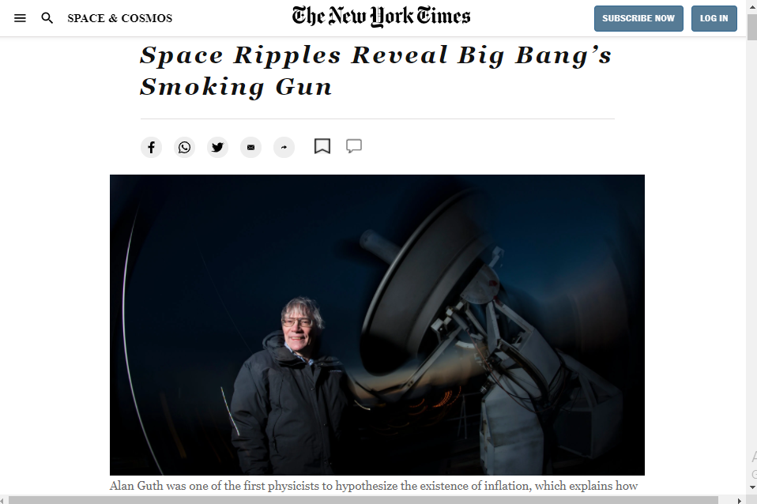

# Project NYT Page
Microverse HTML and CSS Week 1 Project
    This project is centered on understanding of HTML & CSS. 
    For the Week 1 project is mainly to practice positioning and floating elements of elements with both languages.

## Built With

- HTML
- CSS
    
## Linters Used:

- Lighthouse
- Weblint
- Stylelint
    
## Live Demo

- Project [Live Demo Link](https://dansam5k.github.io/project-nyt-page/)
    
## Getting Started

- To get a local copy up and running follow these simple example steps.

### Prerequisites

- Have a compatible web browser that supports HTML5 and CSS3 in order to correctly display the website.
- A text editor in order to view and edit code. Popular text editors include VSCode and Notepad++.

### Setup

On GitHub bash 
    _git clone https://github.com/DanSam5K/project-nyt-page.git_

### Usage

- Most Operative Systems have the .html file extension associated to open with your default web browser.
> In order to review the code, you may use your web browser inspect element option or open directly with a text editor.

- In the cloned folder access open
    _index.html_

## 👤 Daniel Samuel

- GitHub: [DanSam5K](https://github.com/DanSam5K)
- Twitter: [@_dan_sam](https://twitter.com/_dan_sam)
- LinkedIn: [LinkedIn](https://www.linkedin.com/in/dansamuel/)

## 🤝 Contributing

Contributions, issues, and feature requests are welcome!

Feel free to check the issues page.
Show your support

Give a ⭐️ if you like this project!
Acknowledgments